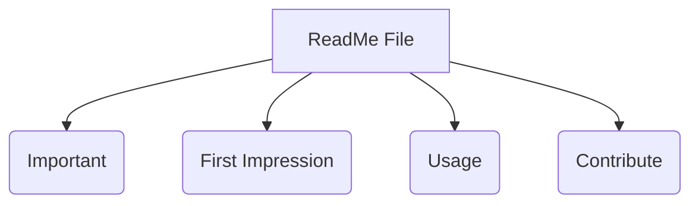

# ReadMe Better:

Tips for writing a better ReadMe file for your project.

### Table of Contents
- [Introduction](#introduction)
- [Markdown CheatSheets](#markdown-cheatsheets)
- [mermaid graphs](#mermaid-graphs)

### Introduction

A ReadMe file is the first thing that a user sees when they visit your project repository. It is important to have a well written ReadMe file to make sure that the user understands what your project is about and how to use it.

### Markdown CheatSheets

Markdown is a lightweight markup language with plain text formatting syntax. It is easy to read and write. Here are some cheat sheets that you can use to write a better ReadMe file.

TODO: Add markdown cheat sheets

### mermaid graphs

Mermaid is a simple markdown-like script language for generating charts from text via javascript. It is a great way to add flowcharts, sequence diagrams, gantt charts, and more to your ReadMe file.

Here is an example chart showing role of a readme file in a project:

### Contibute
Feel like contributing to this project? Fork it and send a pull request. Any kind of help is always appreciated.